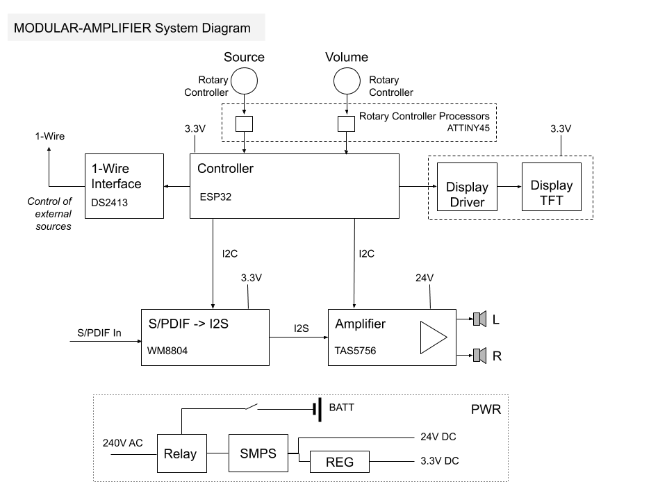

# Modular Audio Project - Amplifier Module

An D-class amplifier module that can select other S/PDIF sources. Control of the sources is over the [1-Wire protocol](https://www.maximintegrated.com/en/design/technical-documents/tutorials/1/1796.html).

## System Diagram

